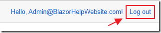
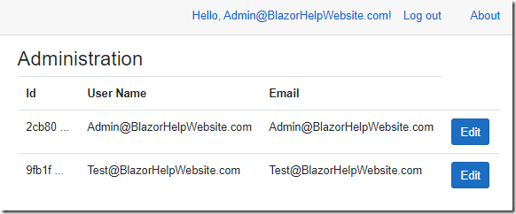

# CV_6_example_of_authentification_and_roles

# A Simple Blazor User and Role Manager

You can create a simple administration page to allow you to create, update, and delete users in your server side Blazor application by adding a single .razor page. This example also demonstrates how to update the passwords for your users.

It does this by programmatically creating an Administrator role in the Microsoft ASP.NET Core Identity membership and programmatically providing administrator access to a designated user (by placing them in the Administrators role).

 

The Application


When you run the application for the first time, you will need to click the Register link and create an account called Admin@BlazorHelpWebsite.com.

 


The Entity Framework Core migrations will run (to create the database)…

 


…and you will then be able to log into the application with that account.

 


The application is coded to programmatically add that account to the Administrators role if the user navigates to the Administration page and they are not an Administrator…

 



…but to have the application recognize this, you will have to log out and log back in.

 


When you log back in, you will be able to navigate to the Administration page and see the User Administration.

 


Clicking the Edit button next to an existing user allows you to update the email address of the user, their password (the password will only update if you actually make a change), and their Role (either Users or Administrators – Note: only users in the Administrators role can access the Administration page).

You can either press Save to update the user, or Delete to remove the user from the application.

 


The Add User button allows you to create a new user.

 

# Create The Application


Using Visual Studio 2019 (or higher), create a Blazor server side application.


Change the Authentication…


… and select Individual User Accounts.

Click OK and complete the process to create the application.


# Using SQL SERVER and Roles

Add nuggets

Microsoft.EntityFrameworkCore.SqlServer
Microsoft.EntityFrameworkCore.Tools
Microsoft.EntityFrameworkCore


When the application opens in Visual Studio, to add support for SQL Server , open the Program.cs file, and change the following code:


```
    options.UseSqlite(connectionString));

```

to:

```
    options.UseSqlServer(connectionString));

```


setting up a connection to an existing database in file appsettings.json


```
   "ConnectionStrings": {
    "DefaultConnection": "Server=localhost,1433; Database=DB_NAme; User ID=ADMIN_NAME; Password=DB_PASSWORD; Persist Security Info=False; Encrypt=False"
  },

```


When the application opens in Visual Studio, to add support for Roles, open the Program.cs file, and change the following code:


``` 

            services.AddDefaultIdentity<IdentityUser>()
                .AddEntityFrameworkStores<ApplicationDbContext>();
 

``` 

to:

``` 

            services.AddDefaultIdentity<IdentityUser>()
                .AddRoles<IdentityRole>()
                .AddEntityFrameworkStores<ApplicationDbContext>();
 
```


Add a new page to the project (and a link to it in the navigation menu – see: Creating A Step-By-Step End-To-End Database Server-Side Blazor Application for help doing this), called Administration.razor using the following code:

 

 ```

  @page "/administration"
  @using Microsoft.AspNetCore.Authorization;
  @using Microsoft.AspNetCore.Identity;
  @inject UserManager<IdentityUser> _UserManager
  @inject RoleManager<IdentityRole> _RoleManager
  @inject AuthenticationStateProvider AuthenticationStateProvider
  <h3>Administration</h3>
  <AuthorizeView>
      <Authorized>
          @if (@context.User.IsInRole(ADMINISTRATION_ROLE))
          {
              <p>You are in @ADMINISTRATION_ROLE </p>
          }
          else
          {
              <p>You're not signed in as a user in @ADMINISTRATION_ROLE.</p>
          }
      </Authorized>
      <NotAuthorized>
          <p>You're not loggged in.</p>
      </NotAuthorized>
  </AuthorizeView>
  @code {
      [CascadingParameter]
      private Task<AuthenticationState> authenticationStateTask { get; set; }
      string ADMINISTRATION_ROLE = "Administrators";
      System.Security.Claims.ClaimsPrincipal CurrentUser;
      protected override async Task OnInitializedAsync()
      {
          // ensure there is a ADMINISTRATION_ROLE
          var RoleResult = await _RoleManager.FindByNameAsync(ADMINISTRATION_ROLE);
          if (RoleResult == null)
          {
              // Create ADMINISTRATION_ROLE Role
              await _RoleManager.CreateAsync(new IdentityRole(ADMINISTRATION_ROLE));
          }
          // Ensure a user named Admin@BlazorHelpWebsite.com is an Administrator
          var user = await _UserManager.FindByNameAsync("Admin@BlazorHelpWebsite.com");
          if (user != null)
          {
              // Is Admin@BlazorHelpWebsite.com in administrator role?
              var UserResult = await _UserManager.IsInRoleAsync(user, ADMINISTRATION_ROLE);
              if (!UserResult)
              {
                  // Put admin in Administrator role
                  await _UserManager.AddToRoleAsync(user, ADMINISTRATION_ROLE);
              }
          }
          // Get the current logged in user
          CurrentUser = (await authenticationStateTask).User;
      }
  }
 
```

# Run the application.


 


Click the Register link and create a user named Admin@BlazorHelpWebsite.com.


The Entity Framework Core migration page will show.

Click Apply Migrations.

 


After the migrations are applied, refresh the page in the web browser.

 


Click Continue.

 


You will now be logged in.

Navigate to the Administration page.

You will see a message that indicates your are not in the Administrators role (even though code has run, because you navigated to that page, to add your account to that Role).

 


Log out and log back in again, and you will now be recognized as a user in the Administrators role.

 


Create another user.

No matter how many times you log in and out, that user will not be placed in the Administrators role.

 

# List Users

The first step is to list the current users in the application.

First, let’s add some fields and variables to the @code section of the Administration.razor page that we will need now and to support code we will add later:

 ```

    // Property used to add or edit the currently selected user
    IdentityUser objUser = new IdentityUser();
    // Tracks the selected role for the currently selected user
    string CurrentUserRole { get; set; } = "Users";
    // Collection to display the existing users
    List<IdentityUser> ColUsers = new List<IdentityUser>();
    // Options to display in the roles dropdown when editing a user
    List<string> Options = new List<string>() { "Users", "Administrators" };
    // To hold any possible errors
    string strError = "";
    // To enable showing the Popup
    bool ShowPopup = false;
 
```
Let’s also add method stubs for methods we will need later.

We add them now because markup that we will add soon, will refer to these methods, and the code will not compile if the methods do not exist (even though at this point the methods will not actually perform the eventual functionality).

``` 

    void AddNewUser()
    {
    }
    async Task SaveUser()
    {
    }
    async Task EditUser(IdentityUser _IdentityUser)
    {
    }
    async Task DeleteUser()
    {
    }
    void ClosePopup()
    {
        // Close the Popup
        ShowPopup = false;
    }
``` 

Now let us add the code to display the existing users.

Add the following method:

 
```
    public void GetUsers()
    {
        // clear any error messages
        strError = "";
        // Collection to hold users
        ColUsers = new List<IdentityUser>();
        // get users from _UserManager
        var user = _UserManager.Users.Select(x => new IdentityUser
        {
            Id = x.Id,
            UserName = x.UserName,
            Email = x.Email,
            PasswordHash = "*****"
        });
        foreach (var item in user)
        {
            ColUsers.Add(item);
        }
    }
 ```

Also, add the following code to the end of the protected override async Task OnInitializedAsync() method so that the getUsers() method will be invoked when the user navigates to the page:

 ```

        // Get the users
        GetUsers();
 
```
Finally, in the HTML markup section, at the top of the file, replace this line of code:

 

<p>You are in @ADMINISTRATION_ROLE </p>
 

With the following code:

 
```
          <table class="table">
                <thead>
                    <tr>
                        <th>Id</th>
                        <th>User Name</th>
                        <th>Email</th>
                    </tr>
                </thead>
                <tbody>
                    @foreach (var user in ColUsers)
                    {
                        <tr>
                            <td>@user.Id.Substring(0, 5) ...</td>
                            <td>@user.UserName</td>
                            <td>@user.Email</td>
                            <td>
                                <!-- Edit the current forecast -->
                                <button class="btn btn-primary"
                                        @onclick="(() => EditUser(user))">
                                    Edit
                                </button>
                            </td>
                        </tr>
                    }
                </tbody>
            </table>
``` 



When we log in with the Admin@BlazorHelpWebsite.com account and navigate to the Administration page, we see a list of the users.

Note, the Edit button will not actually work at this point.

 

# Add Users

In the UI markup, under the recently added table markup, add the following code to implement the popup to add and edit users and an Add User button to trigger it:

``` 

@if (ShowPopup)
{
    <!-- This is the popup to create or edit a user -->
    <div class="modal" tabindex="-1" style="display:block" role="dialog">
        <div class="modal-dialog">
            <div class="modal-content">
                <div class="modal-header">
                    <h3 class="modal-title">Edit User</h3>
                    <!-- Button to close the popup -->
                    <button type="button" class="close"
                            @onclick="ClosePopup">
                        <span aria-hidden="true">X</span>
                    </button>
                </div>
                <!-- Edit form for the current user -->
                <div class="modal-body">
                    <!-- Only show Id if not a new user -->
                    @if (objUser.Id != "")
                    {
                        <p>@objUser.Id</p>
                    }
                    <!-- Only allow edit if a new user -->
                    @if (objUser.Id != "")
                    {
                        <p>@objUser.UserName</p>
                    }
                    else
                    {
                        <input class="form-control" type="text"
                                placeholder="UserName"
                                @bind="objUser.UserName" />
                    }
                    <input class="form-control" type="text"
                            placeholder="Email"
                            @bind="objUser.Email" />
                    <input class="form-control" type="password"
                            placeholder="Password"
                            @bind="objUser.PasswordHash" />
                    <select class="form-control"
                            @bind="@CurrentUserRole">
                        @foreach (var option in Options)
                        {
                            <option value="@option">
                                @option
                            </option>
                        }
                    </select>
                    <br /><br />
                    <!-- Button to save the user -->
                    <button class="btn btn-primary"
                            @onclick="SaveUser">
                        Save
                    </button>
                    <!-- Only show delete button if not a new record -->
                    @if (objUser.Id != "")
                    {
                        <!-- Button to delete the forecast -->
                        <button class="btn btn-danger"
                                @onclick="DeleteUser">
                            Delete
                        </button>
                    }
                    <br />
                    <span style="color:red">@strError</span>
                </div>
            </div>
        </div>
    </div>
}

<button class="btn btn-success" @onclick="AddNewUser">Add User</button>

```
In the procedure code, change the AddNewUser() method to the following (this is triggered when the Add User button is clicked):

``` 

    void AddNewUser()
    {
        // Make new user
        objUser = new IdentityUser();
        objUser.PasswordHash = "*****";
        // Set Id to blank so we know it is a new record
        objUser.Id = "";
        // Open the Popup
        ShowPopup = true;
    }
 
```
Finally, alter the SaveUser() method to the following:

``` 

   async Task SaveUser()
    {
        try
        {
            // Is this an existing user?
            if (objUser.Id != "")
            {
                // To be implemented later...
            }
            else
            {
                // Insert new user
                var NewUser =
                    new IdentityUser
                    {
                        UserName = objUser.UserName,
                        Email = objUser.Email
                    };
                var CreateResult =
                    await _UserManager
                    .CreateAsync(NewUser, objUser.PasswordHash);
                if (!CreateResult.Succeeded)
                {
                    if (CreateResult
                        .Errors
                        .FirstOrDefault() != null)
                    {
                        strError =
                            CreateResult
                            .Errors
                            .FirstOrDefault()
                            .Description;
                    }
                    else
                    {
                        strError = "Create error";
                    }
                    // Keep the popup opened
                    return;
                }
                else
                {
                    // Handle Roles
                    if (CurrentUserRole == ADMINISTRATION_ROLE)
                    {
                        // Put admin in Administrator role
                        await _UserManager
                            .AddToRoleAsync(NewUser, ADMINISTRATION_ROLE);
                    }
                }
            }
            // Close the Popup
            ShowPopup = false;
            // Refresh Users
            GetUsers();
        }
        catch (Exception ex)
        {
            strError = ex.GetBaseException().Message;
        }
    }
 
```


When we run the application, we can now click the Add User button to open the popup.

 


The popup allows us to enter the information required to create a new user.

 


We can enter information to create a new user, and receive error messages if there are any.

 


The new user is created and can now log in using the password we created.

 

# Update (And Delete)

To enable the Edit button to work, alter the EditUser method to the following:

``` 

    async Task EditUser(IdentityUser _IdentityUser)
    {
        // Set the selected user
        // as the current user
        objUser = _IdentityUser;
        // Get the user
        var user = await _UserManager.FindByIdAsync(objUser.Id);
        if (user != null)
        {
            // Is user in administrator role?
            var UserResult =
                await _UserManager
                .IsInRoleAsync(user, ADMINISTRATION_ROLE);
            if (UserResult)
            {
                CurrentUserRole = ADMINISTRATION_ROLE;
            }
            else
            {
                CurrentUserRole = "Users";
            }
        }
        // Open the Popup
        ShowPopup = true;
    }
``` 

Next, to enable updating to work, alter the SaveUser() method to replace the following code:

``` 

         // To be implemented later...
 
```
with:

 ```

                // Get the user
                var user = await _UserManager.FindByIdAsync(objUser.Id);
                // Update Email
                user.Email = objUser.Email;
                // Update the user
                await _UserManager.UpdateAsync(user);
                // Only update password if the current value
                // is not the default value
                if (objUser.PasswordHash != "*****")
                {
                    var resetToken = 
                        await _UserManager.GeneratePasswordResetTokenAsync(user);
                    var passworduser = 
                        await _UserManager.ResetPasswordAsync(
                            user, 
                            resetToken, 
                            objUser.PasswordHash);
                    if (!passworduser.Succeeded)
                    {
                        if (passworduser.Errors.FirstOrDefault() != null)
                        {
                            strError = 
                                passworduser
                                .Errors
                                .FirstOrDefault()
                                .Description;
                        }
                        else
                        {
                            strError = "Pasword error";
                        }
                        // Keep the popup opened
                        return;
                    }
                }
                // Handle Roles
                // Is user in administrator role?
                var UserResult = 
                    await _UserManager
                    .IsInRoleAsync(user, ADMINISTRATION_ROLE);
                // Is Administrator role selected 
                // but user is not an Administrator?
                if (
                    (CurrentUserRole == ADMINISTRATION_ROLE) 
                    & 
                    (!UserResult))
                {
                    // Put admin in Administrator role
                    await _UserManager
                        .AddToRoleAsync(user, ADMINISTRATION_ROLE);
                }
                else
                {
                    // Is Administrator role not selected 
                    // but user is an Administrator?
                    if ((CurrentUserRole != ADMINISTRATION_ROLE) 
                        & 
                        (UserResult))
                    {
                        // Remove user from Administrator role
                        await _UserManager
                            .RemoveFromRoleAsync(user, ADMINISTRATION_ROLE);
                    }
                }

```
Finally, alter the DeleteUser() method to the following:

``` 

    async Task DeleteUser()
    {
        // Close the Popup
        ShowPopup = false;
        // Get the user
        var user = await _UserManager.FindByIdAsync(objUser.Id);
        if (user != null)
        {
            // Delete the user
            await _UserManager.DeleteAsync(user);
        }
        // Refresh Users
        GetUsers();
    }
```


When you run the application, you will now have the ability to update and delete users.

 
